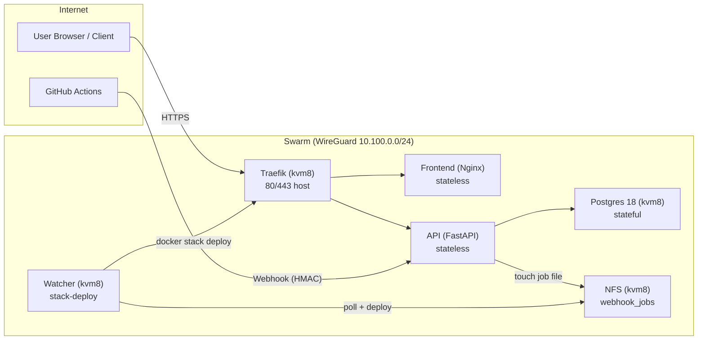

# Video Outline: Docker Swarm Baseline (3 VPS, Production-ish)

Este roteiro e' intencionalmente honesto: e' uma base pequena, simples e
replicavel. Nao e' Netflix, mas e' um ponto de partida que um dev consegue
subir, entender, manter e ir evoluindo.

Docs relacionados:

- `DEV_GUIDE.md`: bootstrap completo (SSH/UFW/fail2ban/WireGuard/NFS). Fica fora
  do video para nao virar curso infinito.
- `docs/VIDEO_SCRIPT.md`: versao detalhada (SHOW/SAY/CMD/CUT) para gravacao.

## Objetivo Do Video

- Subir um cluster Docker Swarm em 3 VPS.
- Ter TLS com Traefik na borda (apenas 1 VPS exposta na internet).
- Deploy automatico via GitHub Actions + GHCR + webhook.
- Banco Postgres para ter estado real (e explicar o gargalo/SPOF).
- Deixar claro o caminho de evolucao para "mais empresarial".

## Publico Alvo

- Dev que ja sabe Docker/Compose e quer dar o proximo passo.
- Pessoa que quer algo mais "prod" sem virar um curso infinito.

## O Que Vamos Entregar (Ao Final)

- `https://app.<seu-dominio>/` com frontend.
- `https://app.<seu-dominio>/api/visit` com API + Postgres.
- Push no `main` gera build no GHCR e um deploy no Swarm via webhook.

## Premissas E Tradeoffs (Fale No Inicio)

- 3 VPS nao permitem HA real de tudo sem complexidade.
- SPOFs neste baseline:
- Traefik (1 replica com `mode: host` em `80/443`).
- Postgres (1 replica).
- NFS (1 servidor).
- Isso e' ok para a proposta: baseline simples e evolutivo.

## Cronograma Sugerido (30-45 min)

1. 0:00-2:00 Contexto e objetivo (o que e o baseline e o que nao e).
2. 2:00-8:00 Visao da arquitetura (WireGuard + Swarm + Traefik + GHCR).
3. 8:00-15:00 Bootstrap das VPS (UFW, fail2ban, WireGuard).
4. 15:00-25:00 Swarm init/join, networks, labels, secrets.
5. 25:00-35:00 Deploy do stack e validacao (curl + logs).
6. 35:00-40:00 Deploy automatizado (push -> webhook -> watcher -> deploy).
7. 40:00-45:00 Como evoluir (managers/workers, storage, DB HA, observabilidade).

## Arquitetura (explicacao simples)

- Internet -> Traefik (kvm8) -> services no overlay
- `frontend`: stateless, pode escalar.
- `api`: stateless, pode escalar.
- `postgres`: stateful, fica fixo no kvm8.
- Webhook do GitHub -> API -> cria arquivo em NFS -> watcher -> `docker stack deploy`.

Mermaid (opcional, se quiser colocar na edicao):



## Checklist Antes De Gravar

- DNS `APP_DOMAIN` apontando para o IP publico do `kvm8`.
- `docker login ghcr.io` feito no `kvm8` (e/ou nos nos, se necessario).
- WireGuard ok entre os nos (ping entre `10.100.0.x`).
- UFW ativo com regras minimas (Swarm + 80/443 no kvm8).
- NFS montado em todos os nos:
- `findmnt /mnt/nfs` em `kvm2/kvm4/kvm8`.

## Bloco: Comandos (para mostrar na tela)

### 1) Swarm bootstrap

No `kvm8`:

```bash
docker swarm init --advertise-addr 10.100.0.8
```

Nos demais:

```bash
docker swarm join --token <TOKEN> 10.100.0.8:2377
```

### 2) Networks e label

```bash
cd /opt/dockerswarmp1
just swarm-networks
just swarm-label-kvm8
```

### 3) Secrets

```bash
cd /opt/dockerswarmp1
. .env
printf '%s' "$GITHUB_WEBHOOK_SECRET" | docker secret create github_webhook_secret -
printf '%s' "$POSTGRES_PASSWORD" | docker secret create postgres_password -
```

### 4) Deploy

```bash
cd /opt/dockerswarmp1
just stack-deploy
```

### 5) Validacao rapida

```bash
just stack-services
just stack-ps
just stack-logs traefik
just stack-logs api
```

E do seu computador:

```bash
curl -fsS https://app.myswarm.cloud/ | head
curl -fsS https://app.myswarm.cloud/api/visit
```

## Bloco: Deploy Automatico (o que explicar)

- Pipeline:
- Push no `main` -> GitHub Actions roda testes/lint -> build images -> push GHCR -> chama webhook.
- API valida HMAC e enfileira "job" no NFS.
- watcher (systemd) faz debounce e roda `docker stack deploy --with-registry-auth`.

O que o dev aprende aqui:

- Deploy sem SSH do GitHub para o server.
- Segredos ficam no Swarm.
- Atualizacao controlada via `docker stack deploy`.

## Bloco: Escalar Com Bom Senso

- `traefik=1` (host ports).
- `postgres=1` (stateful).
- `api`:
- Baseline: `2` replicas.
- Demo: `3` replicas (1 por no).
- `frontend`:
- Baseline: `1`.
- Demo: `2`.

Comando:

```bash
docker service scale dockerswarmp1_api=3 dockerswarmp1_frontend=2
```

Ponto importante para falar:

- Escalar `api` aumenta pressao no Postgres (conexoes/IO).
- Uma VPS pequena costuma "doer" no disco/IO antes de CPU.

## Bloco: Como Evoluir Para Empresarial (sem prometer milagres)

1. Separar managers e workers: 3 managers dedicados + workers para workloads.
2. Tirar NFS e usar storage distribuido: Ceph/Longhorn (ou equivalente) dependendo do budget.
3. Postgres HA: Patroni, etc., ou DB gerenciado.
4. Edge HA: load balancer externo / floating IP / BGP (depende do provedor).
5. Observabilidade: Prometheus + Grafana, e logs centralizados (Loki/ELK).

Frase curta sugerida:

"A gente nao precisa disso hoje. A gente precisa de uma base que funciona e um
mapa claro de como evoluir quando o projeto pedir."

## Problemas Comuns (Se Der Ruim Ao Vivo)

- `docker stack deploy` warning de digest:
- rode `docker login ghcr.io` e use `--with-registry-auth` (ja esta no `just stack-deploy`).
- NFS nao montou no boot:
- rode `findmnt /mnt/nfs` e `sudo mount -a`.
- webhook nao dispara:
- checar segredo HMAC e endpoint `/api/webhook/github`.
