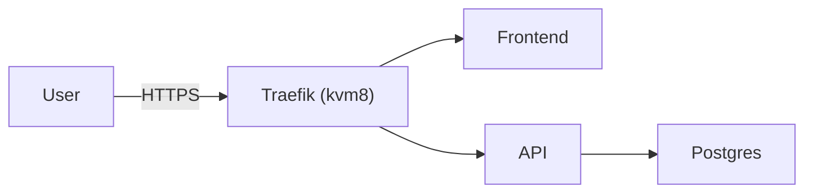
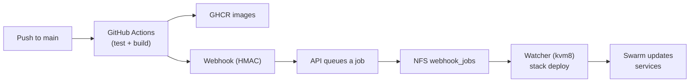

# Video Script (Section-by-Section)

Formato: blocos curtos e objetivos, com `SHOW` (o que aparece na tela), `SAY`
(fala), `CMD` (comandos), `CUT` (cortes) e `NEXT` (gancho).

Este script acompanha `docs/VIDEO_OUTLINE.md`.

## 0) Preparacao (antes de gravar)

SHOW:

- `docs/VIDEO_OUTLINE.md` (visao geral)
- `DEV_GUIDE.md` (bootstrap completo, fora do video)
- `README.md` (runbook do projeto)

SAY:

"O bootstrap completo (SSH/UFW/fail2ban/WireGuard/NFS) esta no `DEV_GUIDE.md`.
No video eu vou focar no Swarm + deploy + tradeoffs."

## 1) 0:00-2:00 Contexto e objetivo

HOOK (primeiros 30-60s)

SHOW:

- Browser: `https://app.myswarm.cloud/`
- Browser: `https://app.myswarm.cloud/api/visit`
- terminal (rapido): `docker node ls`

SAY:

"Em 30-45 minutos voce vai sair com um baseline de producao em 3 VPS:
Docker Swarm, TLS com Traefik, deploy automatico e um app real."

PROMESSA (sem negativos no 1o minuto)

SAY:

"Se voce ja domina Docker Compose e quer dar o proximo passo, isso aqui e uma
base que voce consegue copiar e ir evoluindo. Sem precisar de um time enorme."

DIAGRAMA (on screen, 10-15s)

SHOW:

- diagrama runtime (mermaid) abaixo



NEXT:

"Agora deixa eu te mostrar o desenho antes de entrar em comando."

## 2) 2:00-8:00 Visao da arquitetura

SHOW:

- diagrama (mermaid) do `docs/VIDEO_OUTLINE.md`
- diagrama deploy (mermaid) abaixo

SAY (simples, em 60s):

- "Internet entra no Traefik no kvm8."
- "Traefik roteia pro frontend e pra API."
- "API conversa com Postgres."
- "Deploy vem do GitHub Actions (GHCR) e um webhook aciona o Swarm."



CALL-OUT (decisoes do baseline)

SAY:

"O ponto aqui e simplificar: o cluster so faz pull e atualiza servicos. A gente
escala o que e stateless (API e frontend) e deixa stateful fixo por enquanto."

"As limitacoes e tradeoffs (Traefik/DB/storage) eu explico mais adiante, quando
a gente ja tiver o baseline rodando."

NEXT:

"Vamos pro Swarm: init/join, networks, labels e secrets."

## 3) 8:00-15:00 Bootstrap das VPS (pular no video)

SAY (10-20s):

"Toda a parte de hardening e bootstrap (SSH, UFW, fail2ban, WireGuard, NFS)
eu deixei pronta e documentada no `DEV_GUIDE.md`."

SHOW (rapido):

- `ip -brief addr show wg0`
- `sudo ufw status`
- `findmnt /mnt/nfs`

NEXT:

"Assumindo isso pronto, agora e Swarm."

## 4) 15:00-25:00 Swarm init/join, networks, labels, secrets

SHOW:

- terminal no `kvm8` e depois nos outros nos (ou screen recordings curtas)

SAY:

"Aqui e a parte que troca totalmente o jogo vs Compose: a gente cria o cluster
e depois o deploy vira declarativo com `docker stack`."

CMD (kvm8):

```bash
docker swarm init --advertise-addr 10.100.0.8
```

CMD (kvm2/kvm4):

```bash
docker swarm join --token <TOKEN> 10.100.0.8:2377
```

CMD (networks + label):

```bash
cd /opt/dockerswarmp1
just swarm-networks
just swarm-label-kvm8
```

SAY (por que label):

"Banco e Traefik ficam fixos no kvm8 (mais potente). Sem storage distribuido,
isso evita surpresa."

CMD (secrets):

```bash
cd /opt/dockerswarmp1
. .env
printf '%s' "$GITHUB_WEBHOOK_SECRET" | docker secret create github_webhook_secret -
printf '%s' "$POSTGRES_PASSWORD" | docker secret create postgres_password -
```

NEXT:

"Deploy do stack e validacao."

## 5) 25:00-35:00 Deploy do stack e validacao

CMD:

```bash
cd /opt/dockerswarmp1
just stack-deploy
```

SHOW:

- `just stack-services`
- `just stack-ps`
- `just stack-logs traefik`

SAY:

"Se voce vier do Compose, aqui e onde voce percebe que o cluster faz o
scheduling e a reconcilacao: replicas, restart, updates."

VALIDAR (do seu PC):

```bash
curl -fsS https://app.myswarm.cloud/ | head
curl -fsS https://app.myswarm.cloud/api/visit
```

NEXT:

"Agora o diferencial: push no main vira deploy automatico."

## 6) 35:00-40:00 Deploy automatico (push -> webhook -> watcher -> deploy)

SHOW:

- GitHub Actions: workflow rodando
- terminal no kvm8: `just watcher-logs`

SAY:

"Aqui o server nao faz build. Ele so faz pull. Quem builda e o GitHub Actions e
publica no GHCR. Quando termina, ele chama um webhook assinado (HMAC)."

SAY (curto):

- "API valida assinatura."
- "API enfileira job (touch no NFS)."
- "Watcher faz debounce e roda `docker stack deploy`."

NEXT:

"Pra fechar, escalabilidade e caminho de evolucao."

## 7) 40:00-45:00 Como evoluir (sem prometer milagres)

SAY:

"O baseline e pequeno e intencional. Se voce for crescer, aqui esta o mapa:"

1. 3 managers dedicados + workers.
2. Storage distribuido (tirar NFS).
3. Postgres HA (Patroni ou DB gerenciado).
4. Edge HA (LB/floating IP).
5. Observabilidade (Prometheus/Grafana e logs centralizados).

FINAL:

"Se voce curtiu, no proximo video a gente pega 1 dessas pecas e evolui sem
reconstruir tudo do zero."
